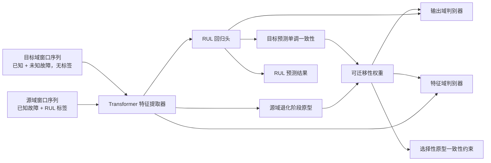

# SODA-RUL: Selective Open-set Domain Adaptation for RUL Prediction

面向未知故障模式的选择性开放集域自适应剩余寿命预测

本目录包含项目的核心代码。完整项目说明见仓库根目录的 `README.md`。

## 项目简介

本项目研究工业设备剩余寿命预测中的开放集域自适应问题。传统 RUL 域自适应方法通常假设源域和目标域具有相同的故障模式，但在真实工业场景中，目标设备可能出现源域从未见过的未知故障模式。如果仍然对所有目标样本做全局域对齐，未知故障样本会被强行拉向源域分布，导致负迁移。

SODA-RUL 在 Transformer RUL 预测模型的基础上，估计目标样本的可迁移性权重，只对更可能属于已知故障模式的目标样本进行强对齐，对疑似未知故障模式样本进行弱对齐，从而提升开放集跨故障场景下的 RUL 预测稳定性。

## 核心创新

1. **开放集跨故障 RUL 域自适应任务构造**

   在 XJTU-SY 轴承数据集上构造源域为单一已知故障、目标域为已知故障与未知故障混合的迁移任务。

2. **目标样本可迁移性权重估计**

   使用源域退化阶段原型相似度和目标预测序列的单调退化一致性共同估计目标样本是否适合参与对齐：

   ```text
   w_t = prototype_similarity x monotonic_consistency
   ```

3. **选择性特征级与输出级域对齐**

   将可迁移性权重引入特征级对抗对齐和输出级对抗对齐，使高权重目标样本强对齐，低权重目标样本弱对齐，降低未知故障模式带来的负迁移。

4. **面向 RUL 回归任务的开放集判断机制**

   不依赖分类置信度，而是利用 RUL 任务中的退化阶段结构和单调退化先验来判断目标样本可迁移性。

## 方法框架



总损失函数：

```text
L = L_rul + alpha L_feature_adv + beta L_output_adv + gamma L_mono + delta L_proto
```

## 代码说明

```text
model.py              # Transformer RUL backbone and domain discriminators
loss.py               # adversarial loss and weighted adversarial loss
dataset_xjtu.py       # XJTU-SY feature extraction, windowing, task split
prepare_xjtu.py       # cache XJTU-SY feature files
train_xjtu.py         # training and evaluation for SODA-RUL
train_cmapss.py       # original C-MAPSS adaptation training script
validation_cmapss.py  # original C-MAPSS evaluation script
```

## 数据集划分

开放集任务示例：

```text
c1_outer_to_c2_mixed
source: Bearing1_1, Bearing1_2, Bearing1_3
target: Bearing2_1, Bearing2_2, Bearing2_3, Bearing2_4, Bearing2_5
known fault: outer
unknown faults in target: inner, cage
```

支持的任务：

```text
c1_outer_to_c2_mixed
c1_outer_to_c3_mixed
c2_outer_to_c3_mixed
c3_outer_to_c2_mixed
c1_outer_to_c2_outer
c1_outer_to_c3_outer
```

训练阶段不使用目标域 RUL 标签和故障类型标签，目标标签只用于最终评估 RMSE/MAE。

## 快速开始

安装依赖：

```bash
pip install numpy torch
```

缓存 XJTU-SY 特征：

```bash
python prepare_xjtu.py --data_root ../XJTU-SY_Bearing_Datasets --bearings all
```

运行 SODA-RUL：

```bash
python train_xjtu.py \
  --data_root ../XJTU-SY_Bearing_Datasets \
  --task c1_outer_to_c2_mixed \
  --type 3 \
  --epoch 120 \
  --batch_size 128 \
  --seq_len 32
```

模型保存位置：

```text
online/
```

## 对照方法

`train_xjtu.py` 中的 `--type` 控制方法类型：

| type | 方法 | 含义 |
| --- | --- | --- |
| 0 | Output Alignment | 只做输出级对齐 |
| 1 | DANN | 只做特征级对抗对齐 |
| 2 | Global Feature + Output Alignment | 特征级和输出级全局对齐 |
| 3 | SODA-RUL | 选择性开放集域自适应方法 |

近似 Source-only baseline：

```bash
python train_xjtu.py --task c1_outer_to_c2_mixed --type 2 --a 0 --b 0 --c 0 --d 0
```

## 实验建议

主实验比较：

```text
Source-only
Output Alignment
DANN
Global Alignment
SODA-RUL
```

消融实验：

```text
Full SODA-RUL:  --type 3
w/o monotonic:  --type 3 --c 0
w/o prototype:  --type 3 --d 0
weak selection: --type 3 --min_weight 1
```

评价指标：

```text
RMSE, MAE
```

## 参考

基础模型参考：

```bibtex
@article{li2022domain,
  title={Domain Adaptive Remaining Useful Life Prediction With Transformer},
  author={Li, Xinyao and Li, Jingjing and Zuo, Lin and Zhu, Lei and Shen, Heng Tao},
  journal={IEEE Transactions on Instrumentation and Measurement},
  volume={71},
  pages={1--13},
  year={2022},
  publisher={IEEE}
}
```

